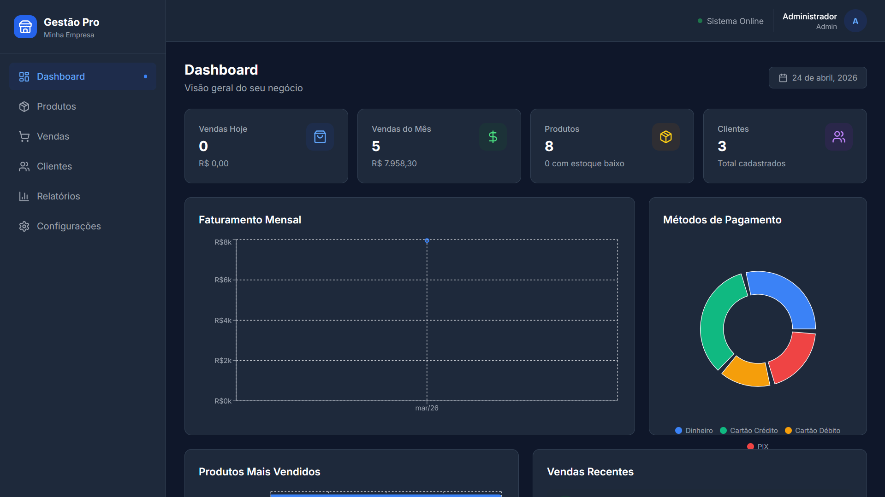
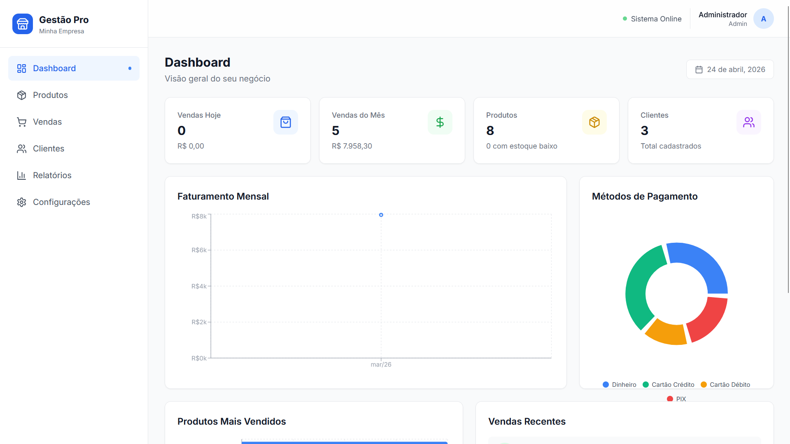
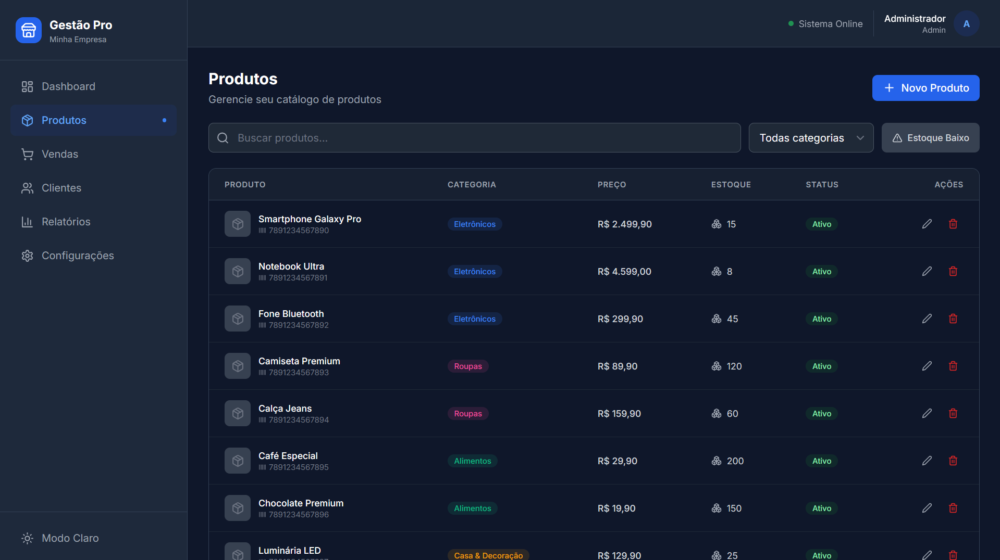
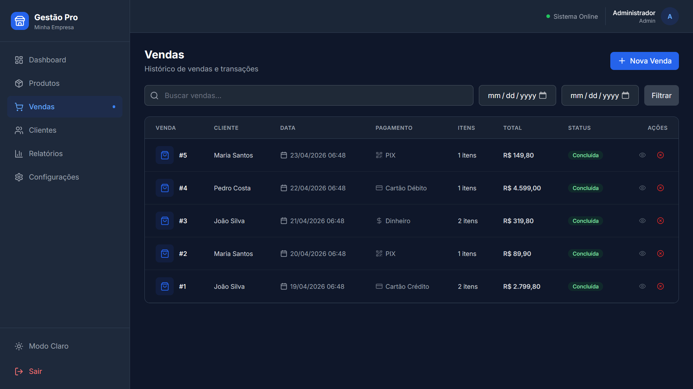
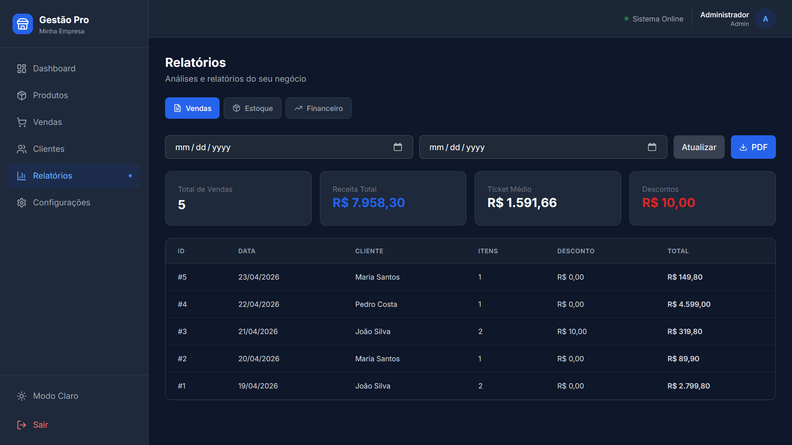
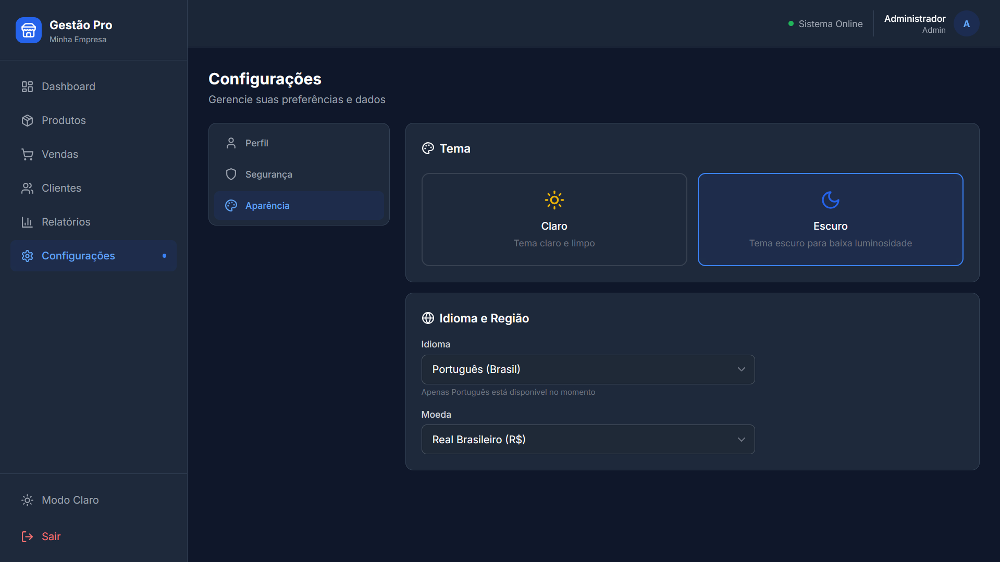
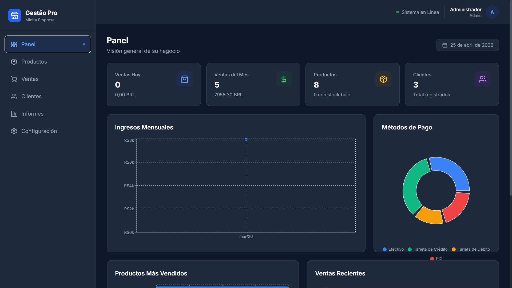

<div align="center">
  <h1>📊 Gestão Pro</h1>
  <p><strong>Sistema Completo de Gestão para Pequenos Negócios</strong></p>
  <p>
    
    
    
    
    
  </p>
  <p>
    <a href="#-funcionalidades">Funcionalidades</a> •
    <a href="#-tecnologias">Tecnologias</a> •
    <a href="#-arquitetura">Arquitetura</a> •
    <a href="#-como-rodar">Como Rodar</a> •
    <a href="#-testes">Testes</a> •
    <a href="#-decisoes-tecnicas">Decisões Técnicas</a>
  </p>
</div>

---

## 🌍 Idiomas / Languages

- [Português (Brasil)](#-gestão-pro)
- [English](#-management-system)
- [Español](#-sistema-de-gestión)

---

# 🇧🇷 Gestão Pro

Sistema completo de gestão empresarial com dashboard moderno, landing page, API REST documentada, autenticação JWT, suporte a múltiplos idiomas, moedas internacionais com cotação em tempo real, relatórios em PDF e tema claro/escuro.

> 💡 **Projeto desenvolvido** para demonstrar competências em desenvolvimento web moderno, arquitetura de APIs, UX/UI e DevOps.

---

## ✨ Funcionalidades

### Dashboard
- 📈 Gráficos interativos de vendas, produtos e métricas em tempo real
- 📅 Filtros por período e comparações de crescimento
- 🎨 Tema claro/escuro com persistência

### Gestão de Produtos
- 📦 CRUD completo com categorias e controle de estoque
- 🏷️ Código de barras e alertas de estoque baixo
- 💰 Controle de preço de custo e margem

### PDV (Ponto de Venda)
- 🛒 Registro rápido de vendas
- 💳 Múltiplas formas de pagamento (dinheiro, cartão, PIX, boleto)
- 🧾 Descontos e observações por venda

### Clientes
- 👥 Cadastro completo com histórico de compras
- 📄 CPF/CNPJ, telefone e endereço
- 🔍 Busca e filtros avançados

### Relatórios
- 📑 Geração de relatórios em PDF com Puppeteer
- 📊 Relatórios de vendas, estoque e despesas
- 📅 Exportação por período

### Internacionalização (i18n)
- 🌐 3 idiomas: Português, Inglês e Espanhol
- 💱 6 moedas suportadas (BRL, USD, EUR, GBP, CNY, BTC)
- 🔄 Cotação em tempo real via API externa

### Segurança
- 🔐 Autenticação JWT com refresh token
- 🛡️ Helmet, Rate Limiting e CORS configurados
- 🔒 Senhas criptografadas com bcrypt

---

## 🛠 Tecnologias

### Frontend
| Tecnologia | Versão | Propósito |
|-----------|--------|-----------|
| React | 18.2 | UI declarativa e componentizada |
| Vite | 5.0 | Build tool ultrarrápido |
| Tailwind CSS | 3.3 | Estilização utilitária |
| Recharts | 2.10 | Gráficos interativos |
| Framer Motion | 10.16 | Animações fluidas |
| Axios | 1.6 | Cliente HTTP |
| date-fns | 2.30 | Manipulação de datas |

### Backend
| Tecnologia | Versão | Propósito |
|-----------|--------|-----------|
| Node.js | 20 | Runtime JavaScript |
| Express | 4.18 | Framework web |
| MySQL2 | 3.6 | Driver de banco de dados |
| JWT | 9.0 | Autenticação stateless |
| Puppeteer | 21.6 | Geração de PDFs |
| Helmet | 7.1 | Segurança de headers HTTP |
| express-rate-limit | 7.1 | Proteção contra brute force |
| Swagger | 6.2 | Documentação da API |

### DevOps & Ferramentas
- **Docker** + Docker Compose — ambientes isolados e reproduzíveis
- **ESLint** + **Prettier** — padronização de código
- **Husky** + **lint-staged** — qualidade no pré-commit
- **GitHub Actions** — CI/CD com testes e lint em PRs
- **Jest** (backend) + **Vitest** (frontend) — testes automatizados

---

## 🏗 Arquitetura

```
gestao/
├── 📁 backend/               # API REST Node.js + Express
│   ├── config/               # Database + Swagger
│   ├── middleware/           # Auth, validação, erros
│   ├── routes/               # Rotas da API (7 módulos)
│   ├── scripts/              # Setup do banco de dados
│   ├── tests/                # Testes com Jest + Supertest
│   └── server.js             # Entry point
│
├── 📁 frontend/              # SPA React + Vite
│   ├── src/
│   │   ├── components/       # Componentes reutilizáveis
│   │   ├── contexts/         # Auth, Theme, Locale (i18n)
│   │   ├── pages/            # 8 páginas do sistema
│   │   ├── services/         # Cliente API (Axios)
│   │   └── tests/            # Testes com Vitest + Testing Library
│   └── index.html
│
├── 📁 landing/               # Landing page estática (HTML/CSS/JS)
├── 📁 screenshots/           # Screenshots para documentação
├── 📁 .github/workflows/     # CI/CD GitHub Actions
└── docker-compose.yml        # Orquestração completa
```

### Diagrama de Arquitetura

```
┌─────────────┐     ┌─────────────┐     ┌─────────────┐
│   Landing   │────▶│  Frontend   │────▶│   Backend   │
│   (HTML)    │     │  (React)    │     │  (Express)  │
└─────────────┘     └──────┬──────┘     └──────┬──────┘
                           │ JWT Bearer        │
                           ▼                   ▼
                    ┌─────────────┐     ┌─────────────┐
                    │  LocalStorage│     │   MySQL 8   │
                    │  (Token)    │     │  (Dados)    │
                    └─────────────┘     └─────────────┘
```

---

## 🚀 Como Rodar

### Opção 1: Docker (Recomendado)

```bash
# Clone o repositório
git clone https://github.com/seu-usuario/gestao.git
cd gestao

# Suba todos os serviços com um comando
docker-compose up -d

# Acesse:
# Frontend:  http://localhost:5173
# Backend:   http://localhost:5000
# API Docs:  http://localhost:5000/api-docs
# MySQL:     localhost:3306
```

### Opção 2: Local (Node.js 18+)

```bash
# 1. Instale as dependências
cd backend && npm install
cd ../frontend && npm install

# 2. Configure as variáveis de ambiente
cp .env.example .env        # na raiz
cp backend/.env.example backend/.env

# 3. Inicie o MySQL e crie o banco
cd backend && npm run setup

# 4. Rode backend e frontend (em terminais separados)
cd backend && npm run dev      # http://localhost:5000
cd frontend && npm run dev     # http://localhost:5173
```

### 🔑 Acesso Padrão
- **Email:** `admin@gestao.com`
- **Senha:** `admin123`

---

## 🧪 Testes

```bash
# Backend (Jest + Supertest)
cd backend && npm test           # Com cobertura
cd backend && npm run test:watch # Modo watch

# Frontend (Vitest + Testing Library)
cd frontend && npm test          # Com cobertura
cd frontend && npm run test:watch # Modo watch

# Tudo de uma vez (na raiz)
npm test
```

---

## 📚 Documentação da API

Acesse a documentação interativa (Swagger UI) em:

```
http://localhost:5000/api-docs
```

Endpoints principais:

| Método | Endpoint | Descrição |
|--------|----------|-----------|
| POST | `/api/auth/register` | Criar conta |
| POST | `/api/auth/login` | Login |
| GET | `/api/auth/me` | Perfil do usuário |
| GET | `/api/products` | Listar produtos |
| POST | `/api/sales` | Criar venda |
| GET | `/api/reports/dashboard` | Dados do dashboard |
| GET | `/api/reports/pdf` | Gerar relatório PDF |

---

## 🧠 Decisões Técnicas

### Por que separar Landing Page do Frontend?
A landing page é estática (HTML/CSS puro) para permitir deploy independente e carregamento instantâneo, sem dependência do React. Isso melhora SEO e tempo de carregamento inicial.

### Por que MySQL em vez de MongoDB?
Escolhi MySQL porque o domínio do projeto (gestão empresarial) possui relações bem definidas entre entidades (vendas → itens → produtos → categorias). SQL oferece consistência ACID e integridade referencial nativa, essenciais para dados financeiros.

### Por que Context API em vez de Redux?
Para o tamanho do projeto, Context API + `useReducer` oferecem estado global suficiente sem boilerplate excessivo. Se a aplicação crescesse, Redux Toolkit ou Zustand seriam o próximo passo.

### Por que Puppeteer para PDFs?
Puppeteer permite gerar PDFs a partir de templates HTML/CSS, oferecendo controle total sobre o layout. Alternativas como PDFKit exigem posicionamento manual de elementos.

### Cotação de Moedas em Tempo Real
Integrei a API pública `open.er-api.com` para cotações e CoinGecko para Bitcoin, com cache no localStorage para evitar rate limits e melhorar performance.

---

## 📸 Screenshots

### Dashboard (Dark Mode)


### Dashboard (Light Mode)


### Produtos


### Vendas


### Relatórios


### Configurações - Aparência


### Dashboard em Espanhol


---

## 🗺 Roadmap

- [x] Sistema de autenticação JWT
- [x] CRUD de produtos, clientes, vendas
- [x] Dashboard com gráficos
- [x] Relatórios em PDF
- [x] i18n (3 idiomas)
- [x] Multi-moeda com cotação
- [x] Dark/Light mode
- [x] Docker + docker-compose
- [x] Testes automatizados
- [x] CI/CD GitHub Actions
- [x] Documentação Swagger
- [ ] Testes E2E com Cypress/Playwright
- [ ] Notificações push
- [ ] Módulo de fornecedores
- [ ] Integração com gateways de pagamento

---

## 🤝 Contribuindo

Contribuições são bem-vindas! Siga os passos:

1. Faça um fork do projeto
2. Crie uma branch: `git checkout -b feature/nova-feature`
3. Commit suas mudanças: `git commit -m 'feat: adiciona nova feature'`
4. Push para a branch: `git push origin feature/nova-feature`
5. Abra um Pull Request

> O projeto usa **Conventional Commits** e possui hooks de pré-commit com ESLint + Prettier.

---

## 📄 Licença

Este projeto está licenciado sob a [MIT License](LICENSE).

---

<div align="center">
  <p>Desenvolvido com 💙 para pequenos negócios</p>
  <p>
    <a href="https://www.linkedin.com/in/valentim-palacio-149197223/">LinkedIn</a> •
    <a href="mailto:palaciovalentim6@gmail.com">Email</a>
  </p>
</div>

---

# 🇺🇸 Management System

Complete business management system with a modern dashboard, landing page, documented REST API, JWT authentication, multi-language support, international currencies with real-time exchange rates, PDF reports, and light/dark theme.

> 💡 **Developed as a fullstack portfolio project** to demonstrate modern web development, API architecture, UX/UI, and DevOps skills.

## Features
- 📈 Interactive dashboard with real-time charts
- 📦 Product management with stock control
- 🛒 POS with multiple payment methods
- 👥 Customer management with purchase history
- 📑 PDF reports with Puppeteer
- 🌐 3 languages + 6 currencies with live exchange rates
- 🔐 JWT authentication with security middleware
- 🐳 Docker support for one-command setup
- 🧪 Automated tests (Jest + Vitest)
- 📚 Swagger API documentation

## Quick Start
```bash
docker-compose up -d
# Access: http://localhost:5173
```

See full documentation in [Portuguese](#-gestão-pro) above.

---

# 🇪🇸 Sistema de Gestión

Sistema completo de gestión empresarial con panel de control moderno, página de inicio, API REST documentada, autenticación JWT, soporte para varios idiomas, monedas internacionales con cotización en tiempo real, informes en PDF y tema claro/oscuro.

> 💡 **Proyecto desarrollado como portafolio fullstack** para demostrar competencias en desarrollo web moderno, arquitectura de APIs, UX/UI y DevOps.

## Características
- 📈 Panel de control interactivo con gráficos en tiempo real
- 📦 Gestión de productos con control de stock
- 🛒 Punto de venta con múltiples métodos de pago
- 👥 Gestión de clientes con historial de compras
- 📑 Informes en PDF con Puppeteer
- 🌐 3 idiomas + 6 monedas con cotización en vivo
- 🔐 Autenticación JWT con middleware de seguridad
- 🐳 Soporte Docker
- 🧪 Pruebas automatizadas
- 📚 Documentación Swagger de la API

## Inicio Rápido
```bash
docker-compose up -d
# Acceso: http://localhost:5173
```

Ver documentación completa en [Portugués](#-gestão-pro) arriba.
